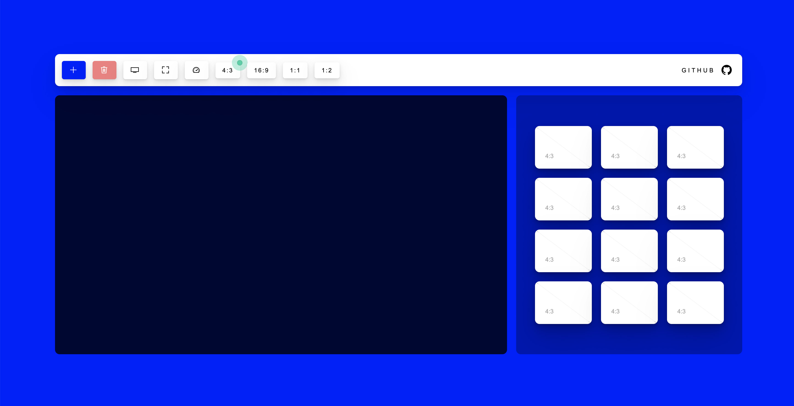
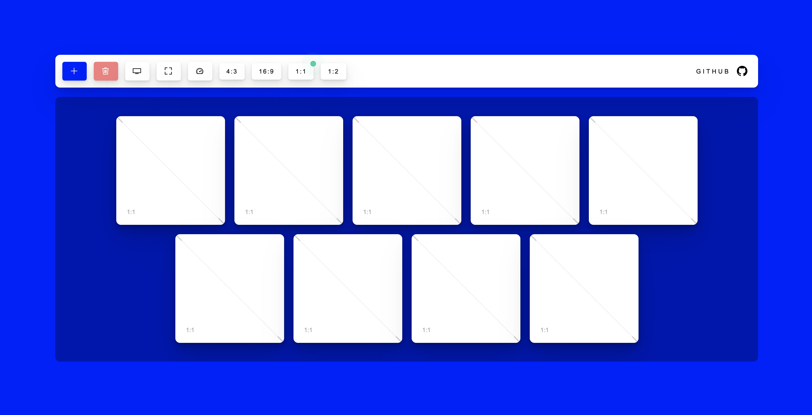
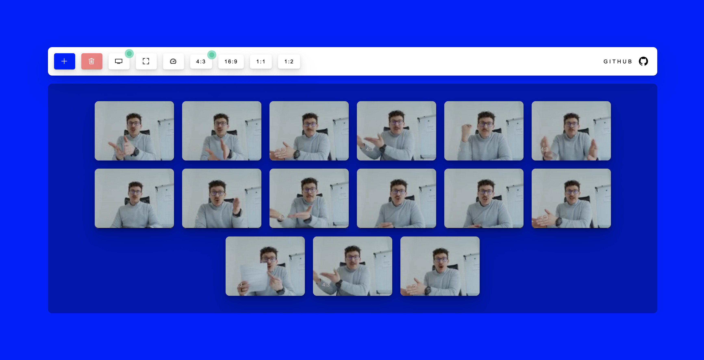

# Videoconference-Dish | [DEMO](https://alicunde.github.io/Videoconference-Dish-CSS-JS/)

This script respects the Aspect Ratio, allows margins and does not use a grid. Lightweight and easy to understand.

I have searched the internet a lot and I have not found this script. It just keeps the aspect ratio of a div and covers the largest area of its parent.

Its use is mainly oriented to videoconferencing systems and not to make strange cuts.

| Function             | Description                             |
| -------------------- | --------------------------------------- |
| Aspect Ratio         | Option to add new aspect ratios         |
| Flex                 | My intention is to make use of flex     |
| Good Perfomance      | Fast and little code                    |
| Video animations     | Executed when starting playback         |
| Much commented code  | Focused on being easy to copy           |
| Very basic CSS       | I have not wanted to reinvent the wheel |
| Clean generated HTML | It makes use of few divs                |

It is built with few lines of code. It makes use of JavaScript and CSS. JavaScript is vanilla and surely you can optimize it.

The CSS is really basic, basically I have not wanted to fill this example with code and make it easy to copy and paste.

If you see any errors, I would appreciate if you would indicate the improvement or the bug.

